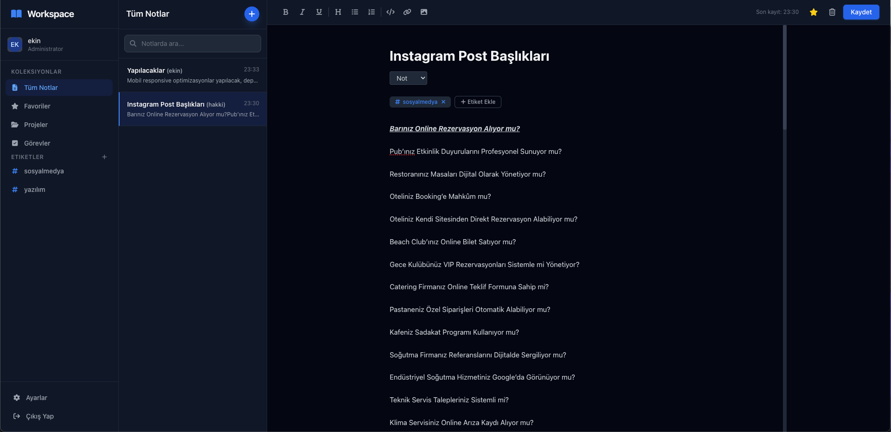

Yet another project management system.



## Kurulum (SQLite)

Bu proje varsayilan olarak SQLite kullanir.

1. Bagimliliklari kurun:

```bash
pip install -r requirements.txt
```

2. `.env` dosyasini olusturun:

```env
SECRET_KEY=your-secret-key
```

3. Migrationlari uygulayin:

```bash
python manage.py migrate
```

4. Uygulamayi baslatin:

```bash
python manage.py runserver
```